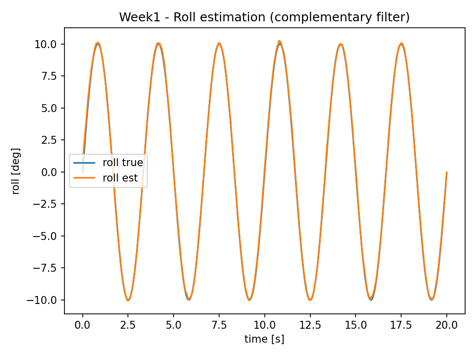
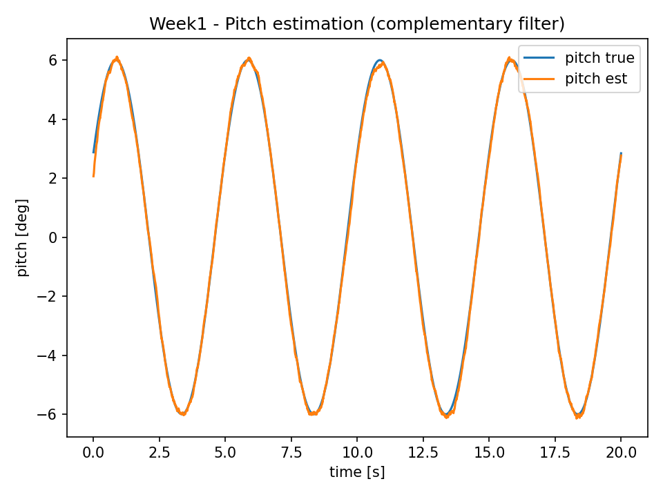

# \# IMU Attitude Estimation + PID Control (Week 1)

# 

# \## Goal

# A minimal, laptop-only project demonstrating an end-to-end pipeline:

# IMU (gyro/accel) → attitude estimation (roll/pitch) → PID tracking of a target attitude.

# 

# \## Scope (Week 1)

# \- Attitude propagation using gyroscope integration

# \- Roll/Pitch correction using accelerometer (complementary filter)

# \- PID controller for roll/pitch step tracking

# \- Save result figures under `results/figures/`

# 

# \## How to run

# ```bash

# pip install -r requirements.txt

# python src/run\_week1.py

## Results
### Roll estimation


### Pitch estimation



